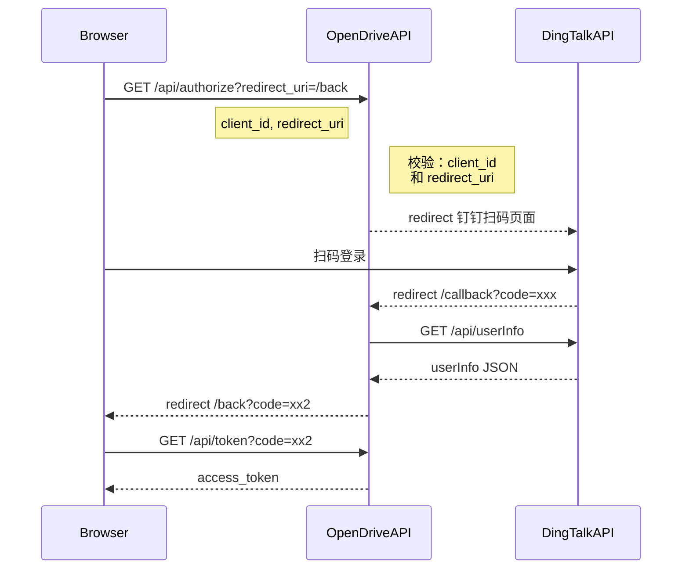
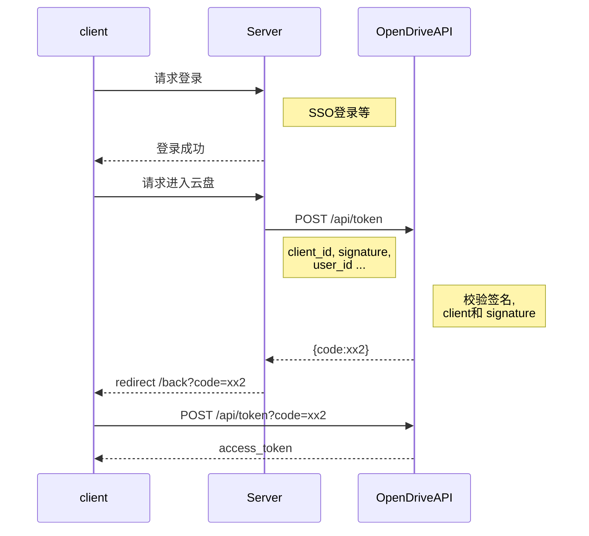
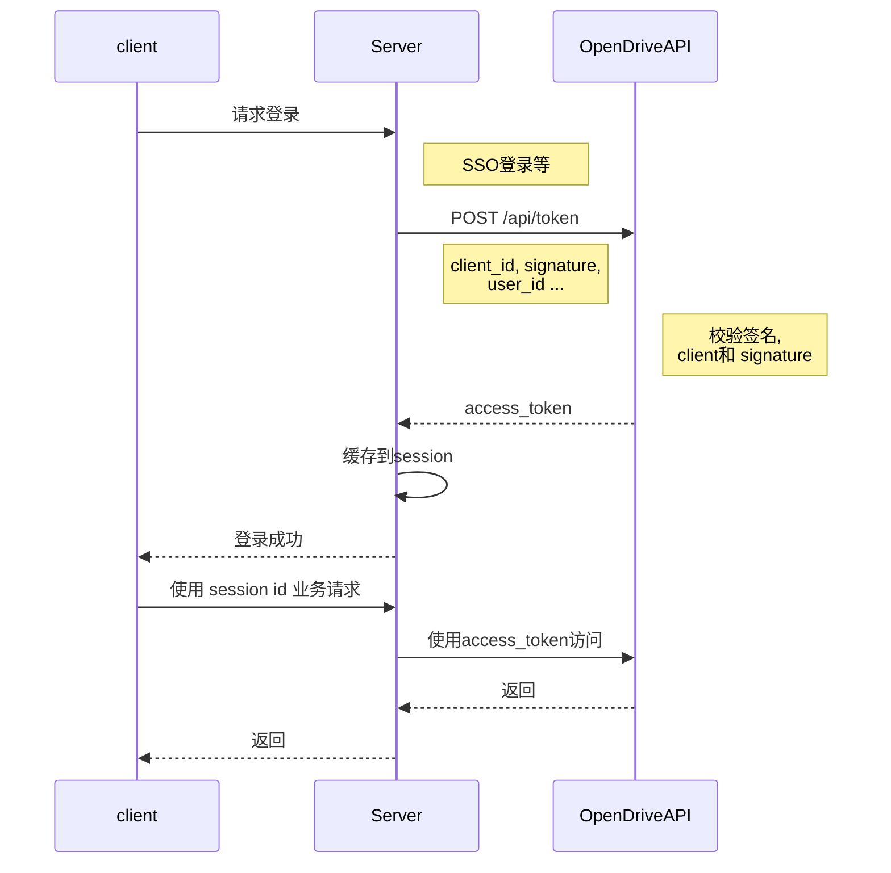
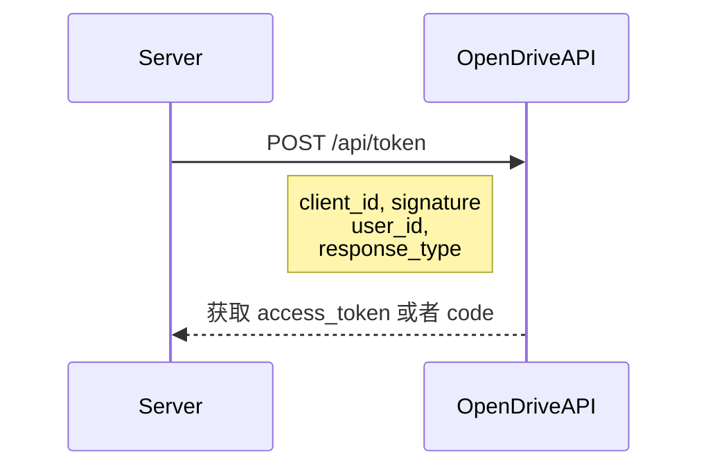

# 登录 API


## 0. 几种登录方式


### (1) OAuth2





* [钉钉第三方WEB网站扫码登录文档](https://open-doc.dingtalk.com/docs/doc.htm?spm=a219a.7629140.0.0.ZtbPaC&treeId=168&articleId=104882&docType=1)

> 适用于第三方网站授权。无需 secret 参数, 但需要校验 client 的 redirect_uri。

### (2) 客户端模式1


第三方服务(as客户端), 使用分配 client_id 和 signature (由secret和其他参数签成)，带上用户ID等信息，直接调用 OpenDriveAPI 的 /token 接口获取 code, 然后redirect到页面，页面通过 code 获取 access_token。



> 如果想使用OpenDrive的UI界面，但是需要接入自己的用户账号体系，可以使用这种方式。


### (3) 客户端模式2


第三方服务(as客户端), 使用分配 client_id 和 signature (由secret和其他参数签成)，带上用户信息，直接调用 OpenDriveAPI 的获取token接口，返回 access_token。




> 如果要在现有的应用中加入云盘功能，不能直接使用云盘API（比如现有应用使用cookie session机制，需要用Server做代理等）可以使用这种模式，Server 获取 access_token 缓存在session中。


## 1. Authorize

> 统一登录接口

### (1) 请求
```
GET /api/authorize
```

#### 参数

|参数|必选|描述|
|---|---|---|
|client_id|是|开发者向平台申请的client_id|
|response_type|是|表示授权类型，此处的值固定为"code"|
|redirect_uri|是|表示重定向URI，重定向的URI上会带code和state参数，code用于获取id_token|
|scope|否|表示鉴权方式, 有dingding_qrcode, dingding_login, alipay三种，dingding_qrcode表示钉钉扫码登录， dingding_login表示钉钉输入用户名密码登录， alipay表示支付宝登录。默认: dingding_qrcode。|
|state|否|表示客户端的当前状态，可以指定任意值，认证服务器会原封不动地返回这个值, 可以为：uuid|


### (2) 返回(重定向)

```
302

Location: ${redirect_uri}?code=${code}[&state=${state}]
```

#### 重定向参数
|参数|必选|描述|
|---|---|---|
|code|是|该码的有效期为10分钟，客户端只能使用该码一次，否则会被授权服务器拒绝。该码与客户端ID和重定向URI，是一一对应关系|
|state|否|如果请求中有state，这里会原封不动地返回这个值|


## 2. Authorize Callback

> 第三方登录成功后回调(内部接口)

### (1) 请求

```
GET /api/callback?code=${code}&state=${state}
```


#### 重定向参数
|参数|必选|描述|
|---|---|---|
|code|是| 第三方服务返回的code，该码的有效期为10分钟，客户端只能使用该码一次，否则会被授权服务器拒绝。该码与客户端ID和重定向URI，是一一对应关系|
|state|否| 第三方服务返回的state。如果请求中有state，这里会原封不动地返回这个值|


### (2) 返回(重定向)

```
302

Location: ${redirect_uri}?code=${code}[&state=${state}]
```

## 3. Get AccessToken

> 获取 AccessToken

### (1) 请求
```
GET /api/token
```

#### 参数

|参数|必选|描述|
|---|---|---|
|code|是|该码的有效期为10分钟，客户端只能使用该码一次，否则会被授权服务器拒绝。|
|grant_type|是|固定为 authorization_code| 
|client_id|是|开发者向平台申请的client_id|

### (2) 返回

```json
{
    "access_token": "ac******83",
    "token_type": "Bearer",
    "refresh_token": "re******d9",
    "expires_time": "2018-05-02T09:03:32.810Z"
}
```

|参数|必选|描述|
|---|---|---|
|access_token|是|基于OpenID Connect生成的，包含userId等信息的加密字符串,用来访问其他业务API|
|refresh_token|是|refresh_token 是用来刷新 access_token 的 |
|token_type|是| token类型: Bearer |
|expires_time|是|失效时间, 如: "2018-01-01T00:00:00.009Z"|


## 4. Refresh Token

> 刷新 AccessToken


### (1) 请求
```
POST /api/refresh_token
```

#### Body 参数

|参数|必选|描述|
|---|---|---|
|access_token|是| 获取token时返回的access_token |
|refresh_token|是| 获取token时返回的refresh_token |
|grant_type|是| 固定值为refresh_token |

### (2) 返回

```json
{
    "access_token": "ac******83",
    "token_type": "Bearer",
    "refresh_token": "re******d9",
    "expires_time": "2018-05-02T09:03:58.817Z"
}
```

|参数|必选|描述|
|---|---|---|
|access_token|是|新的 AccessToken, 基于OpenID Connect生成的，包含userId等信息的加密字符串|
|refresh_token|是|refresh_token 是用来刷新id_token的 |
|token_type|是| token类型：Bearer |
|expires_time|是|失效时间, 如: "2018-01-01T00:00:00.009Z"|


## 5. 客户端模式鉴权

> 如果您的服务有自己的账号系统和登录系统。在用户登录后，通过调用此方法，换取access_token以调用 OpenDrive 的业务 API。



### (1) 请求
```
POST /api/token

header: {
  authorization: signature //signature是用创建client生成的secret签名
}

body:{
  grant_type: 鉴权方式，此处为client_credentials
  client_id: 创建client生成的ID
  user_id: 客户端对应的user ID
  date: 当前ISO格式时间（注意是ISO格式，不加时区）
  response_type: 'access_token'  //可选 access_token or code
  
  //可选字段
  user_name: 用户名
  nick_name: 昵称
  description: 备注
  avatar: 头像信息, 以 http:// 开头, 或者 base64 data URI
}
```

* 由body传过来的字段，都需要签名。


#### 参数

|参数|必选|位置|描述|
|---|---|---|---|
|authorization|是|headers| 签名信息，服务端会根据此参数鉴权并返回 access_token，签名详细方法见后文。 |
|grant_type|是|body| 鉴权方式，此处为client_credentials |
|client_id|是|body| 客户端生成的client ID |
|user_id|是|body| 客户端对应的user ID |
|date|是|body| 当前ISO格式时间（注意是ISO格式，不加时区） |
|response_type|否|body| 返回token的类型, 可选值: [access_token\|code]默认: access_token |
|user_name|否|body| 用户名称 |
|nick_name|否|body| 昵称名称 |
|description|否|body| 备注 |
|avatar|否|body|头像信息, 以 http:// 开头, 或者 base64 data URI |


### (2) 返回

* response_type=access_token 时返回:

```json
{
    "access_token": "ac******83",
    "token_type": "Bearer",
    "refresh_token": "re******d9",
    "expires_time": "2018-05-02T09:03:32.810Z"
}
```

|参数|必选|描述|
|---|---|---|
|access_token|是|基于OpenID Connect生成的，包含userId等信息的加密字符串|
|refresh_token|是|refresh_token 是用来刷新access_token的 |
|token_type|是| token类型：Bearer |
|expires_time|是|失效时间, 如: "2018-01-01T00:00:00.009Z"|

* response_type=code 时返回:

```json
{
  "code": "xxxxxx"
}
```

### (3) 签名详解

```javascript
// 签名方法： 使用创建client时生成的secret将所有参数签名，然后在用base64转换
Signature = base64(hmac-sha1(ClientSecret, paramsStr))

paramsStr 为method+参数拼接的字符串：

比如method是：POST
下发的参数为：
{
  grant_type: 'client_credentials',
  client_id: "client_id",
  user_id: "user_id",
  date: "2018-05-29T13:08:36.284Z",
  response_type: "access_token",
  //可选项
  //user_name: null,
  nick_name: 'xxx',
  //description: null,
  //avatar: null
}
转换为key=value的形式，如下:
method=POST
grant_type=client_credentials
client_id=client_id
user_id=user_id
date=2018-05-29T13:08:36.284Z
response_type=access_token
nick_name=xxx


按照字符串ASCII码从小到大排序，然后用&拼接，即可生成paramsStr：

var paramsStr = "client_id=client_id&date=2018-05-29T13:08:36.284Z&grant_type=client_credentials&method=POST&nick_name=xxx&response_type=access_token&user_id=user_id"

```

JavaScript实现代码：
```javascript
const crypto = require('crypto');
let date = new Date().toISOString();
let params = {
  grant_type: 'client_credentials',
  client_id: "创建client生成的ID",
  user_id: "客户端对应的user ID",
  date: date,
  response_type:'access_token',

  //可选项
  nick_name: 'xxx'
};

function getSignature(method, params, secret) {
  params.method = method;
  var paramArr = [];
  // 拼接待签名内容
  Object.keys(params).sort().forEach((key) => {
    paramArr.push(`${key}=${params[key]}`);
  });
  var signContent = paramArr.join("&");
  // 根据secret创建签名
  const signature = crypto.createHmac('sha1', secret);
  // 得到签名信息
  return signature.update(Buffer.from(signContent, 'utf8')).digest('base64');
}

let header = {
  authorization: getSignature("POST", params, ClientSecret)
};

http.post("/token", params, header);
```
