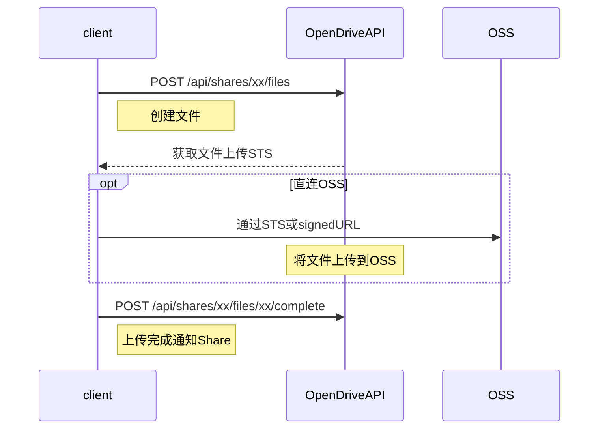

# Files API

> 本文档描述 Files 相关 API。

## 文件上传流程设计




* [OSS文件上传指南](https://help.aliyun.com/document_detail/32069.html)


## 1. 创建文件或目录


### (1) 请求
```
POST /api/shares/:shareId/files
```

```json
{
  "name": "test.txt",
  "type": "file",
  "dir_path": "/",
  "size": "1060"
}
```


#### 参数

|参数|必选|位置|描述|
|---|---|---|---|
| Authorization |是| headers | 'Bearer '+ access_token | 
|shareId|是| path |share ID |
|name|是| body | 目录名称，或文件名称, 最多255个字符 |
|size|是| body | 文件大小|
|type|是| body | 类型: folder, file |
|dir_path|是| body | 创建的文件或目录相对Share的路径。 |
|return_ststoken|否|body|此字段为true，会将文件上传的STS token返回，如果创建的文件已存在，接口不会报错，会将错误信息从error字段返回。|
|return_signed_url|否|body|此字段为true，会将文件上传 signed_url 返回，如果创建的文件已存在，接口不会报错，会将错误信息从error字段返回。|
|signed_url_expires_sec|否|body|失效时间，单位:秒，默认：3600, 如果return_signed_url字段为true，此项生效。|
|content_type|否| body | return_signed_url 为 true 时有效, 默认: ""(空字符串), 一般会直接使用 HTML5 中 File 的 type(可能为"")。 |
|content_md5|否| body | return_signed_url 为 true 时有效, 默认: ""(空字符串), 一般会页面不会传此参数，在客户端才需要。 |

* 推荐用法: 为减少 STS 服务压力，小于 4M 的文件，建议用 signed_url 上传，大于的则用 ststoken。下载请全部用 signed_url。


### (2) 返回

> 201

```json
{
  "group_id": "aliyun",
  "share_id": "share-51967e96d83e4c838924322c8c247fd8",
  "path": "/text.txt"
}
```


`return_ststoken=true` 时返回示例:

> 201
```json
{
  "group_id": "group-b5b4e1070c02480eacf3f51fff319d24",
  "share_id": "share-51967e96d83e4c838924322c8c247fd8",
  "path": "/icon副本.txt",
  "sts": {
    "account_id": "10******34",
    "access_key_id": "STS.L******Le",
    "access_key_secret": "6Z******vM",
    "security_token": "CA******==",
    "expiration": "2018-05-03T10:26:59Z",
    "endpoint": "http://oss-cn-shanghai.aliyuncs.com",
    "bucket": "opendrive-demo",
    "key": "bkyTest/b5836c8d-d41a-4b8b-b48f-7d9d026db365"
  }
}
```

`return_signed_url=true` 时返回示例:

> 201
```json
{
  "group_id": "group-b5b4e1070c02480eacf3f51fff319d24",
  "share_id": "share-51967e96d83e4c838924322c8c247fd8",
  "path": "/icon副本.txt",
  "sts": {
    "method": "PUT",
    "url": "http://xxxxxxxxx",
    "expiration": "2018-05-03T10:26:59Z",
    "region": "oss-cn-shanghai",
    "endpoint": "http://oss-cn-shanghai.aliyuncs.com",
    "bucket": "opendrive-demo",
    "key": "bkyTest/b5836c8d-d41a-4b8b-b48f-7d9d026db365",
    "headers" : {
      "Content-Type": "text/plain",
      "Content-Md5": ""
    }
  }
}
```

#### 字段说明:

|参数|必选|类型|描述|
|---|---|---|---|
|share_id|是 |string|share ID |
|path|是|string| 以share目录为根的文件路径, 以`/`开头 |
|sts|否|object| return_ststoken为true则返回，类型为object，字段与 /sts_token 接口一致 |
|signed|否|object| return_signed_url为true则返回，类型为object，字段与 /signed_url 接口一致 |
|message|否|string|当return_ststoken为true，并且创建的文件已存在时，返回错误信息|


## 2. 获取文件上传下载 sts token

> 大文件分片上传，请用stsToken，小文件请用 [10. 生成签名URL](#/docs/api%2Fapi-share-files?pos=id-30) 的方式。


### (1) 请求

```
POST /api/shares/:shareId/files/:filePath/sts_token
```

```json
{
  "type": "upload"
}
```

#### 参数

|参数|必选|位置|描述|
|---|---|---|---|
| Authorization |是| headers | 'Bearer '+ access_token | 
|shareId|是| path |share ID|
|filePath|是| path |文件路径encodeURI|
|type|否| body |STS类型，只能为 “upload”， 默认为“upload”|

### (2) 返回

> 201

```json
{
  "account_id": "10******34",
  "access_key_id": "STS.L******Le",
  "access_key_secret": "6Z******vM",
  "security_token": "CA******==",
  "expiration": "2018-05-03T10:26:59Z",
  "endpoint": "http://oss-cn-shanghai.aliyuncs.com",
  "bucket": "opendrive-demo",
  "key": "bkyTest/b5836c8d-d41a-4b8b-b48f-7d9d026db365"
}
```

#### 字段说明:

|参数|必选|类型|描述|
|---|---|---|---|
|account_id|是 |string|云账号AccountId|
|access_key_id|是 |string| sts access_key_id |
|access_key_secret|是|string| sts access_key_secret |
|security_token|是|string| sts security_token |
|expiration|是|string| 过期时间, ISO格式, 如:"2018-05-03T10:26:59Z" |
|endpoint|是|string| OSS Endpoint |
|bucket|是|string| OSS Bucket |
|key|是|string| 文件目录key |

### (3) 附录：sts 上传

使用 SDK 参考: https://github.com/ali-sdk/ali-oss#multipartuploadname-file-options


## 3.  完成文件上传后complete

### (1) 请求
```
POST /api/shares/:shareId/files/:filePath/complete
```

#### 参数

|参数|必选|位置|描述|
|---|---|---|---|
| Authorization |是| headers | 'Bearer '+ access_token |
|shareId|是| path |share ID|
|filePath|是| path |文件路径encodeURI|


### (2) 返回

> 200

```json
{
   "code": "OK",
   "message": "success"
}
```


## 4. 获取文件列表


### (1) 请求
```
GET /api/shares/:shareId/files
```

#### 参数

|参数|必选|位置|描述|
|---|---|---|---|
| Authorization |是| headers | 'Bearer '+ access_token |
|shareId|是| path |share ID |
|dirPath|否| query | 父目录路径 |
|name|否| query | 名称前缀查询 |
|url_expires_sec|否| query | 设置download_url和image_snap_url的超时时间， 单位:秒，默认:3600|
|image_snap_url_process|否| query | image_snap_url 的图片处理访问规则, 默认:`image/resize,m_pad,h_64,w_64`, 详见 [OSS图片处理访问规则](https://help.aliyun.com/document_detail/44687.html) |
|marker|否| query |查询起始位置符|
|limit|否| query | 制定返回结果的条数|


### (2) 返回

> 200

```json
{
  "items": [
    {
      "created_at": "2018-06-30T06:14:56.829Z",
      "size": 1060,
      "status": "normal",
      "type": "file",
      "updated_at": "2018-06-30T06:14:56.829Z",
      "share_id": "share-51967e96-d83e-4c83-8924-322c8c247fd8",
      "name": "LICENSE",
      "dir_path": "/",
      "path": "/LICENSE",
      "storage_id": "bkyTest",
      "group_id": "aliyun",
      "download_url": "http://opendrive-demo.oss-cn-shanghai.aliyuncs.com/bkyTest/b5836c8d-d41a-4b8b-b48f-7d9d026db365?OSSAccessKeyId=LT----------6G&Expires=1525344049&Signature=8QvWwykEGAipmBWNOB61ri%2FftMM%3D"
    },
    {
      "group_id": "aliyun",
      "dir_path": "/",
      "status": "normal",
      "type": "file",
      "image_snap_url": "http://opendrive-demo.oss-cn-shanghai.aliyuncs.com/pans/38000ec0-8e77-4491-b546-ed4c6322580e?OSSAccessKeyId=LT----------6G&Expires=1528340592&Signature=V97GQATggx0H3ym58imVWnJAnt0%3D&x-oss-process=image%2Fresize%2Cm_pad%2Ch_64%2Cw_64",
      "size": 14164,
      "updated_at": "2018-06-30T06:14:56.829Z",
      "download_url": "http://opendrive-demo.oss-cn-shanghai.aliyuncs.com/pans/38000ec0-8e77-4491-b546-ed4c6322580e?OSSAccessKeyId=LT----------6G&Expires=1528340592&Signature=1NvE0r4MZvsuzE7NGMGi8NPXjhE%3D&response-content-disposition=attachment%3Bfilename%3Dapps.png",
      "name": "apps.png",
      "path": "/apps.png",
      "created_at": "2018-06-07T02:03:10.436Z",
      "drive_id": "drive-c57d53bbfe49400c941e06caacb31f4e",
      "storage_id": "bkyTest"
    }
  ],
  "next_marker": null
}
```

#### 字段说明:

|字段名称|必选|类型|描述|
|---|---|---|---|
|items|是|array<item\>|item数组|
|next_marker|否|string| 下一页的起始位符 |

* item 项说明:

|字段名称|必选|类型|描述|
|---|---|---|---|
|share_id|是|string|  shareId |
|dir_path|是|string|  父目录路径 |
|path|是|string| 文件或目录路径|
|name|是|string|  文件名或目录名 |
|type|是|string|  类型： file,folder |
|status|是|string|  状态： normal，uploading |
|size|否|int|  文件大小，目录为0 |
|created_at|是|string| 创建时间, ISO格式，如:2018-06-07T02:03:10.436Z |
|updated_at|是|string| 最后修改时间, ISO格式，如:2018-06-07T02:03:10.436Z |
|storage_id|是|string|所属storageId|
|download_url|否|string|下载此文件的url|
|image_snap_url|否|string|图片的缩略图。如果不是图片，则没有此属性|

## 5. 查询文件详情

### (1) 请求
```
GET /api/shares/:shareId/files/:filePath
```

#### 参数

|参数|必选|位置|描述|
|---|---|---|---|
| Authorization |是| headers | 'Bearer '+ access_token | 
|shareId|是| path |share ID|
|filePath|是| path |文件路径encodeURI|
|url_expires_sec|否| query | 设置download_url和image_snap_url的超时时间， 单位:秒，默认:3600|
|image_snap_url_process|否| query | image_snap_url 的图片处理访问规则, 默认:`image/resize,m_pad,h_64,w_64`, 详见 [OSS图片处理访问规则](https://help.aliyun.com/document_detail/44687.html) |


### (2) 返回

> 200

```json
{
    "created_at": "2018-06-30T06:14:56.829Z",
    "size": 1060,
    "status": "normal",
    "type": "file",
    "updated_at": "2018-06-30T06:14:56.829Z",
    "share_id": "share-51967e96-d83e-4c83-8924-322c8c247fd8",
    "name": "LICENSE",
    "dir_path": "/",
    "path": "/LICENSE",
    "storage_id": "bkyTest",
    "group_id": "aliyun",
    "download_url": "http://opendrive-demo.oss-cn-shanghai.aliyuncs.com/bkyTest/b5836c8d-d41a-4b8b-b48f-7d9d026db365?OSSAccessKeyId=LT----------6G&Expires=1525344657&Signature=DEvMHOE3vKHVVrKEPf8lwGeHovM%3D"
}
```
#### 字段说明:
|字段名称|必选|类型|描述|
|---|---|---|--|
|share_id|是|string| shareId |
|dir_path|是|string| 父目录路径 |
|path|是|string|文件或目录路径|
|name|是|string| 文件名或目录名 |
|type|是|string| 类型： file,folder |
|status|是|string| 状态： normal，uploading |
|size|否|int| 文件大小，目录为0 |
|created_at|是|string| 创建时间, ISO格式，如:2018-06-07T02:03:10.436Z |
|updated_at|是|string| 最后修改时间, ISO格式，如:2018-06-07T02:03:10.436Z |
|storage_id|是|string|所属storageId|
|download_url|否|string|下载此文件的url|
|image_snap_url|否|string|图片的缩略图。如果不是图片，则没有此属性|

## 6.  复制文件

> 复制目录不能复制目录下的子文件和子目录。复制目录应使用递归。

### (1) 请求
```
POST /api/shares/:shareId/files/:filePath/copy
```

```json
{
  "new_name": "version",
  "new_dir_path": "/test/"
}
```
#### 参数

|参数|必选|位置|描述|
|---|---|---|---|
| Authorization |是| headers | 'Bearer '+ access_token | 
|shareId|是| path |share ID|
|filePath|是| path |文件路径encodeURI|
|new_dir_path|是| body | 新的文件所在的目录路径 |
|new_name|是| body | 新的文件名称, 最多255个字符 |
|op_type|否| body | 只针对操作目录有效。0代表只操作当前目录，1代表操作目录下所有文件和目录。默认为0 |

### (2) 返回

> 200 or 201

```json
{
  "group_id": "aliyun",
  "share_id": "share-51967e96-d83e-4c83-8924-322c8c247fd8",
  "path": "/test/version"
}
```
#### 字段说明:
|字段名称|必选|类型|描述|
|---|---|---|---|
|share_id|是|string| shareId |
|path|是|string|文件路径|


## 7.  移动文件


> 移动目录不能复制目录下的子文件和子目录。移动目录应使用递归。


### (1) 请求
```
POST /api/shares/:shareId/files/:filePath/move
```

```json
{
  "new_name": "version",
  "new_dir_path": "/test/"
}
```
#### 参数

|参数|必选|位置|描述|
|---|---|---|---|
| Authorization |是| headers | 'Bearer '+ access_token | 
|shareId|是| path |share ID|
|filePath|是| path |文件路径encodeURI|
|new_dir_path|是| path | 新的文件所在的目录路径 |
|new_name|是| path | 新的文件名称, 最多255个字符 |
|op_type|否| body | 只针对操作目录有效。0代表只操作当前目录，1代表操作目录下所有文件和目录。默认为0 |

### (2) 返回

> 200 or 201

```json
{
   "code": "OK",
   "message": "success"
}
```


## 8.  删除文件

### (1) 请求
```
DELETE /api/shares/:shareId/files/:filePath
```

#### 参数

|参数|必选|位置|描述|
|---|---|---|---|
| Authorization |是| headers | 'Bearer '+ access_token | 
|shareId|是| path |share ID|
|filePath|是| path |文件路径encodeURI|
|op_type|否| query | 只针对操作目录有效。0代表只操作当前目录，1代表操作目录下所有文件和目录。默认为0 |


### (2) 返回

> 204


## 9.  完成文件上传后complete(for OSS callback)

### (1) 请求
```
POST /api/share/complete_for_callback
```

#### 参数

|参数|必选|位置|描述|
|---|---|---|---|
| Authorization |是| headers | 'Bearer '+ access_token | 
|shareid|是| body |share ID|
|filepath|是| body |文件路径，无需encodeURI|


### (2) 返回

> 200

```json
{
   "code": "OK",
   "message": "success"
}
```

## 10.  生成签名URL

生成的上传URL，可以通过 PUT 方法，直接上传文件。
生成的下载URL, 可以通过 GET 方法，直接下载文件。

### (1) 请求

```
POST /api/shares/:shareId/files/:filePath/signed_url
```

```json
{
  "type": "upload",
  "expires_sec": 3600,
  "content_type": "text/plain"
}
```

#### 参数

|参数|必选|位置|描述|
|---|---|---|---|
| Authorization |是| headers | 'Bearer '+ access_token | 
|shareId|是| path |share ID|
|filePath|是| path |文件路径encodeURI|
|type |是| body | 类型，默认: upload, 可选范围：download,upload。 |
|expires_sec|是| body | 失效时间，单位:秒，默认：3600 |
|content_type|否| body | type 为 upload 时有效, 默认: ""(空字符串), 一般会直接使用 HTML5 中 File 的 type(可能为"")。type 为 download 时无需。 |
|content_md5|否| body | type 为 upload 时需要，默认: ""(空字符串), 一般会页面不会传此参数，在客户端才需要。 |

### (2) 返回


> 201

```json
{
  "method": "PUT",
  "url": "http://xxxxxxxxx",
  "expiration": "2018-05-03T10:26:59Z",
  "region": "oss-cn-shanghai",
  "endpoint": "http://oss-cn-shanghai.aliyuncs.com",
  "bucket": "opendrive-demo",
  "key": "bkyTest/b5836c8d-d41a-4b8b-b48f-7d9d026db365",
  "headers" : {
    "Content-Type": "text/plain",
    "Content-Md5": ""
  }
}
```

#### 字段说明:
|字段名称|必选|类型|描述|
|---|---|---|---|
|method|是|string| 可选范围: PUT, GET. |
|url|是|string|可以直接上传或下载的URL。如果 type 是 upload，可以通过 PUT 方法，直接上传文件。如果 type 是 download，可以通过 GET 方法，直接下载文件。 |
|expiration|是|string| 过期时间, ISO格式， 如: "2018-05-03T10:26:59Z"|
|endpoint|是|string| OSS Endpoint |
|region|是|string| OSS Region |
|bucket|是|string| OSS Bucket |
|key|是|string| 文件目录key |
|headers|是|object| 如果method为PUT, 则通过此url PUT上传时，需要指定这些请求头。 如果method为GET, 则为通过HEAD方法请求文件返回的响应头。 |

### (3) 附录: signed_url 直接 PUT 上传

```js
$.ajax({
  url: "http://xxxxxxxx",
  method: 'PUT',
  data: file,
  processData: false,
  beforeSend(xhr) {
    xhr.setRequestHeader('Content-Type', file.type);
  },
  crossDomain: true,
  xhr: function () {
    //获取ajaxSettings中的xhr对象，为它的upload属性绑定progress事件的处理函数
    var myXhr = $.ajaxSettings.xhr();
    if (myXhr.upload) {
      //绑定progress事件的回调函数
      myXhr.upload.addEventListener('progress', function(e){
        if (e.lengthComputable) {
          //进度
          console.log(e.loaded , e.total)
        }
      }, false);
    }
    return myXhr; //xhr对象返回给jQuery使用
  },
  success: function () {
    console.log('done')
  },
  error: function (xhr) {
    console.log('ERROR', xhr.responseText)
  }
});
```
