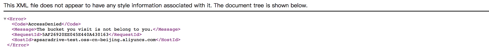
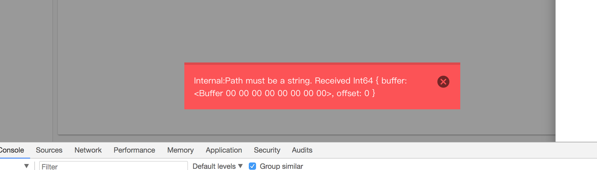
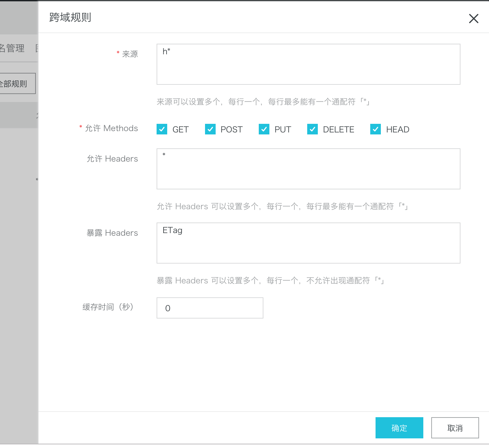

# 常见问题

### 1. UI部署到Bucket之后，访问域名出现一段XML信息，没有直接跳转到登录页面。

* 问题原因：没有设置静态页面为index.html
* 解决办法：在阿里云控制台进入该Bucket，基础设置->静态页面，将默认首页设置为index.html，将默认404页设置为404.html

### 2. 扫码登录后报错：client_id and redirect_uri did not match

* 问题原因：创建client时填写的redirect_uri与部署UI的域名不匹配。
* 解决办法：在官网控制台修改client的redirect_uri字段，使其与部署UI的域名匹配。

### 3. 上传文件报如下错误。

* 问题原因：创建存储配置填写的Bucket没有配置跨域访问规则。
* 解决办法：在阿里云控制台进入该Bucket，点击基础设置->跨域设置->创建规则，按如下配置即可。

