# 使用方法介绍
 
## 1. 默认的管理员

第一个登录的用户，系统默认将他设置为超级管理员。

## 2. 管理员配置Storage

>（指定OSS Bucket和Drive分配策略）

创建Storage之前，需要准备以下资源：

1) 创建一个OSS Bucket，[OSS控制台](https://oss.console.aliyun.com/overview)。

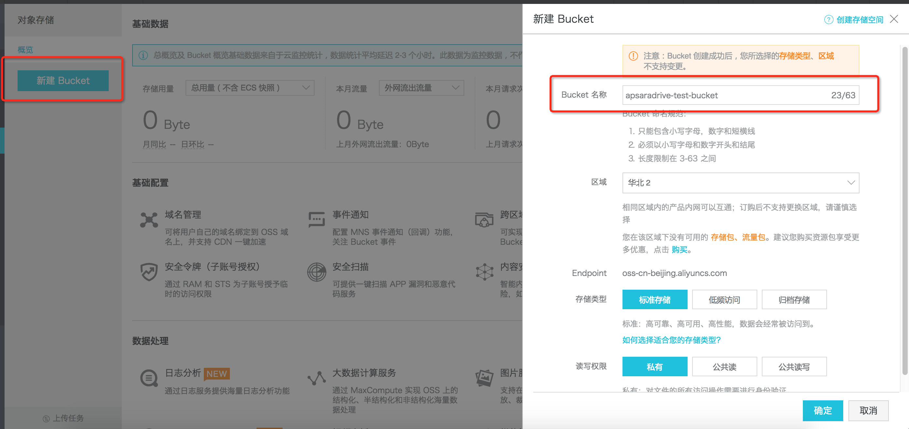

创建成功后，选中该Bucket，点击基础设置->跨域设置->创建规则

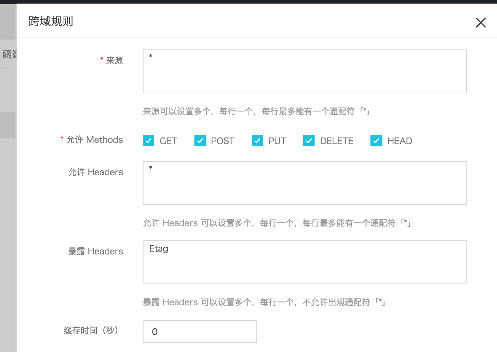
	来源要填写您部署的UI界面所对应的域名，可以配置多个。

2) 创建一个有STSAssumeRole和OSSFull权限的子用户，并且记录下AK信息。

进入[用户管理](https://ram.console.aliyun.com/#/user/list)页面，新建用户

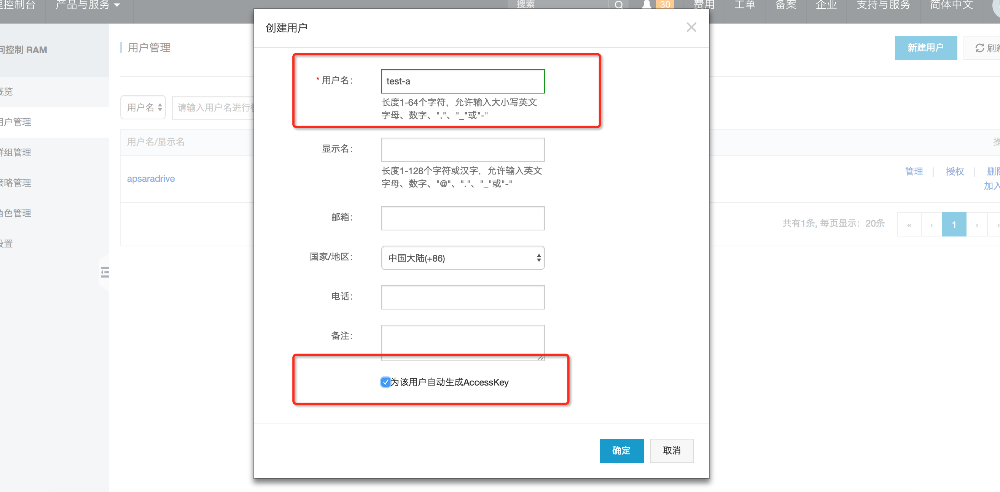

记录下AK信息

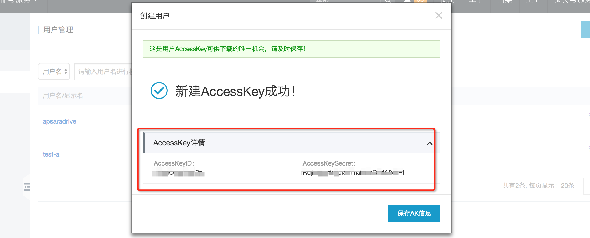

给用户授予STSAssumeRole和OSSFull的权限

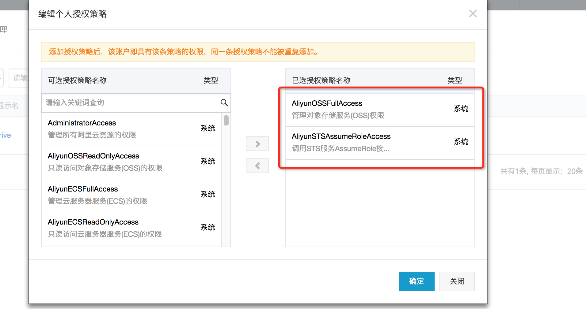

3) 创建一个有OSSFull权限的角色，并记录下Arn

进入[角色管理](https://ram.console.aliyun.com/#/role/list)，创建角色：

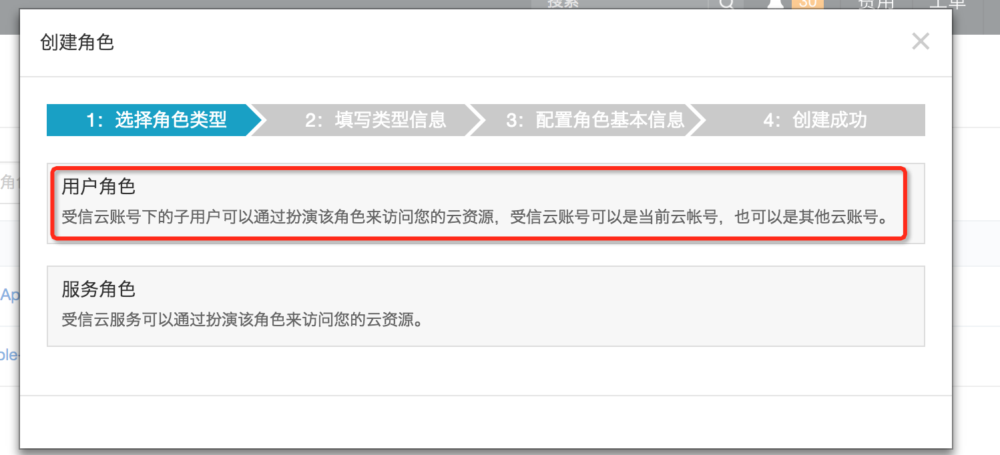

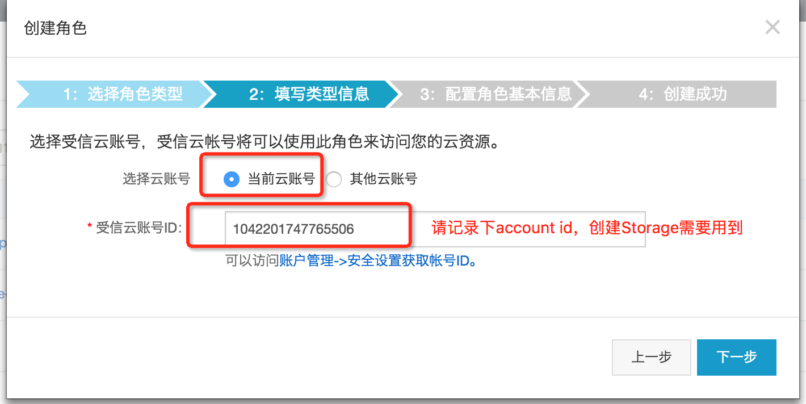

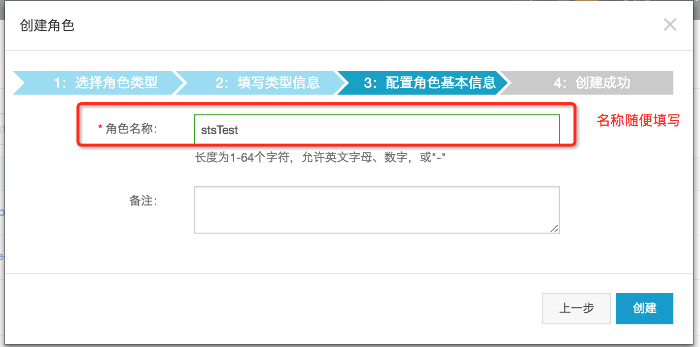

然后给角色授予OSSFull的权限：

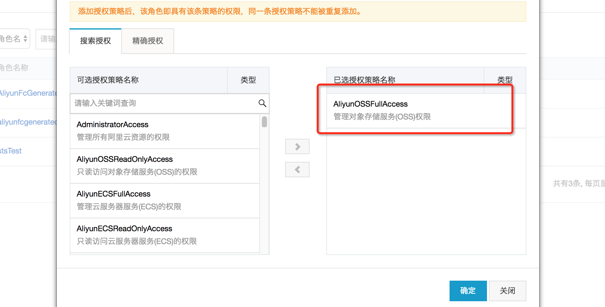

进入角色详情， 记录下角色Arn：

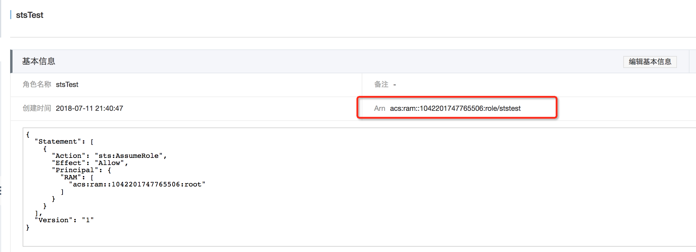

准备工作完毕。

开始创建Storage，进入存储配置，点击创建：

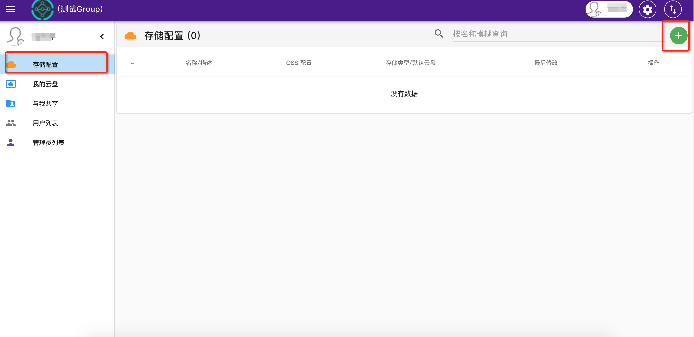

配置Storage参数：

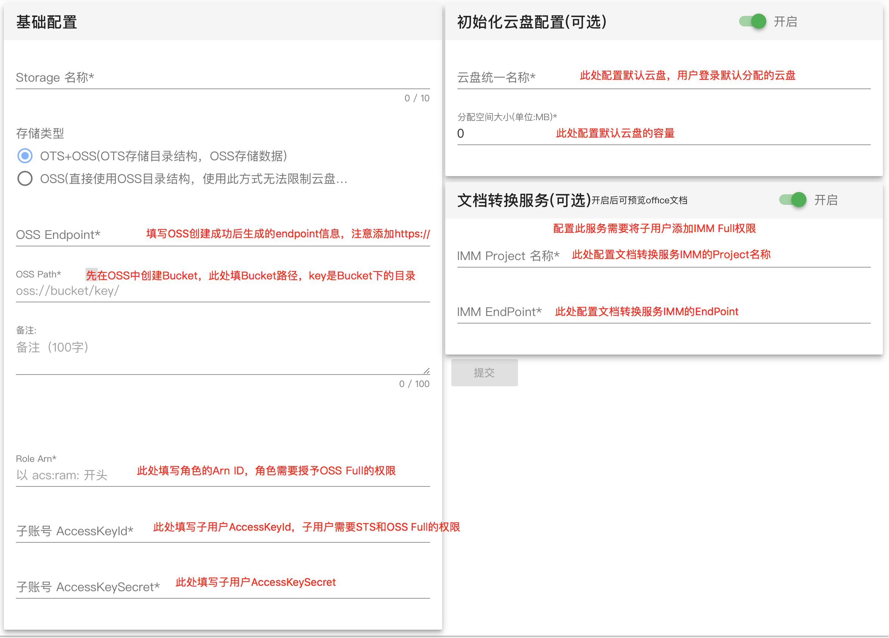

## 3. 给普通用户分配Drive

分配网盘有两种方式，一种是默认网盘，在配置Storage的时候填写。

另一种是管理员手动分配，在存储配置页面，选择一条Storage记录，点击操作列的+号。

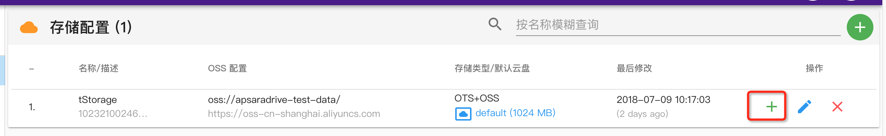

选择一个用户即可分配网盘：

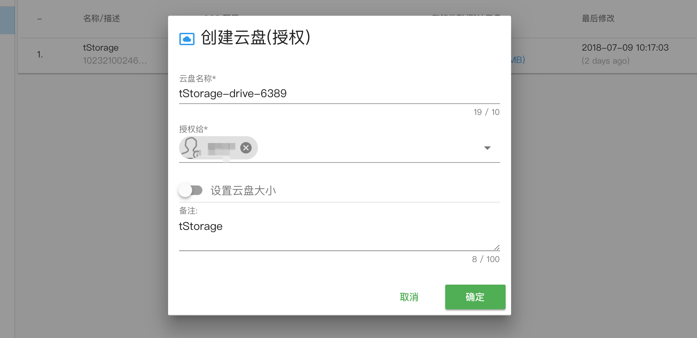

## 4. 上传文件

选择一个网盘进入：

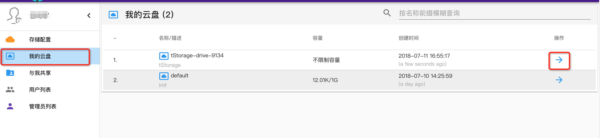

将文件或目录拖拽至空白区域即可上传：

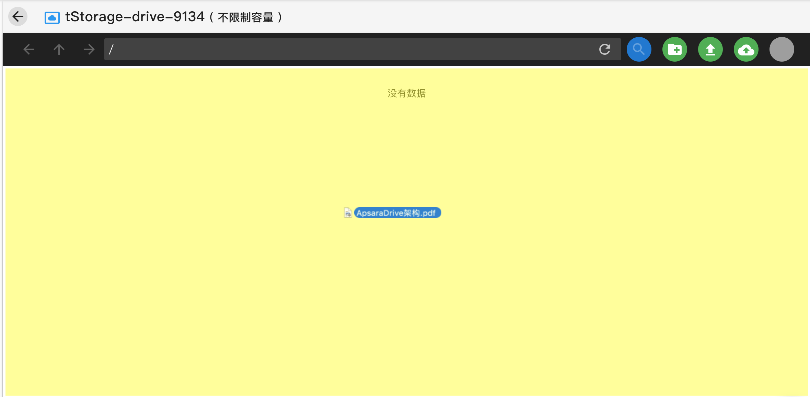

## 5. 下载文件

选择一个文件双击打开，右上角有下载按钮，选择自己需要的方式获取下载链接。

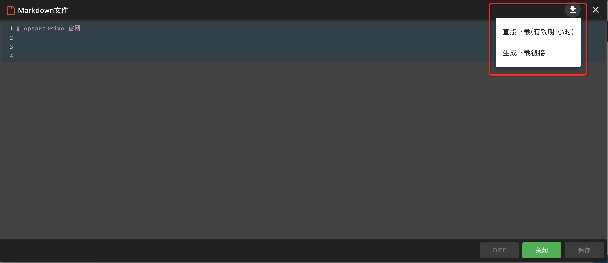

## 6. 共享目录

选择一个目录，点击右下角共享按钮：

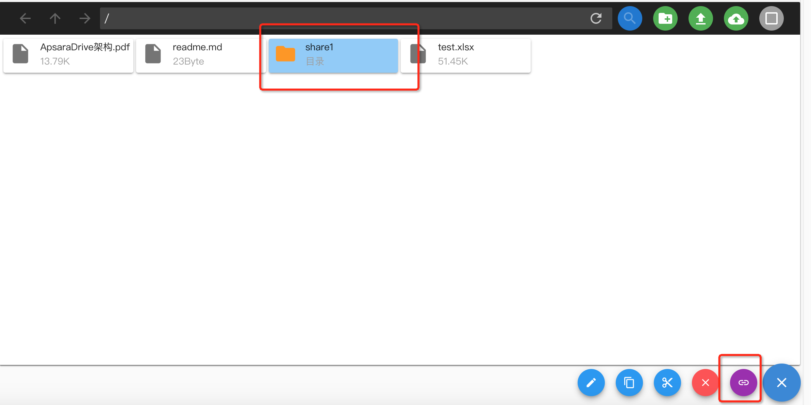

填写共享参数：

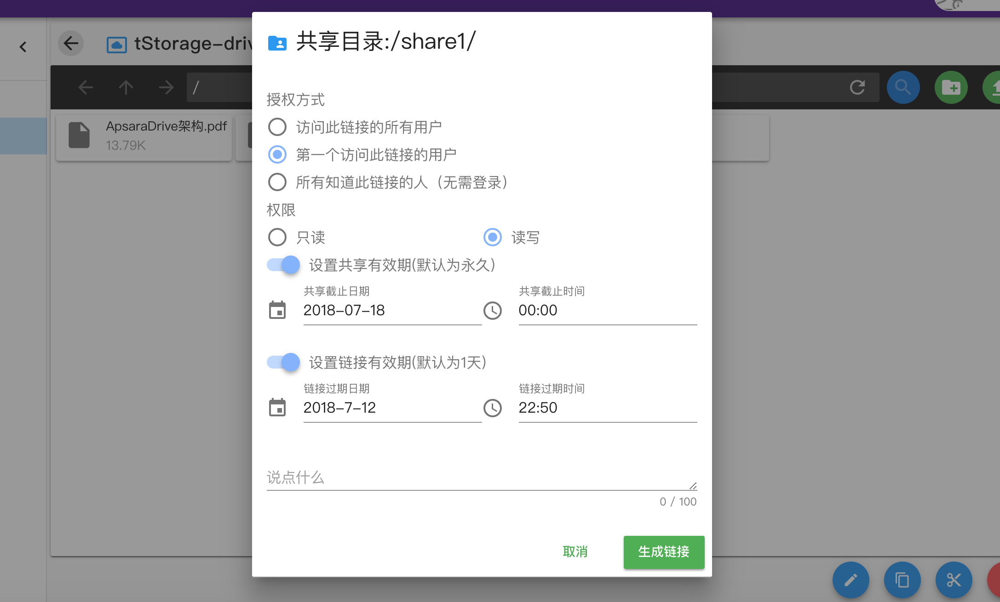

授权方式有三种：
1) 访问此链接的所有用户：访问此链接的用户都会分配一个共享，链接被访问后不会失效。
2) 第一个访问此链接的用户：第一个访问此链接的用户会分配一个共享，访问后链接立刻失效。
3) 所有知道此链接的人： 分享给所有人，无需登录网盘，只要访问链接就可以看到里面的内容。

参数填写完成后点击生成链接，然后将链接通过其他方式发送给需要的人。
